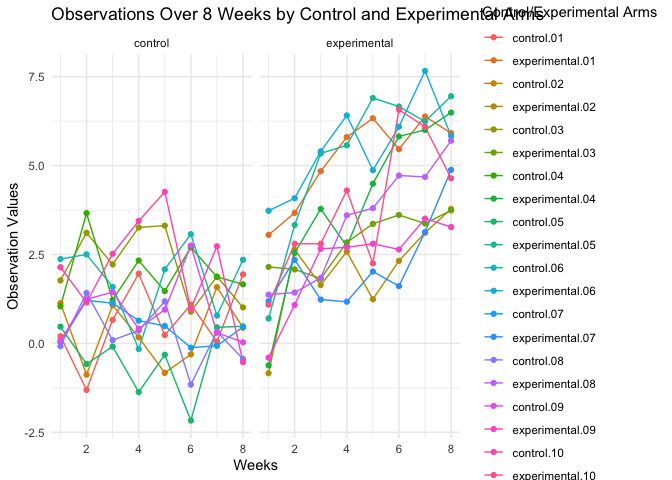
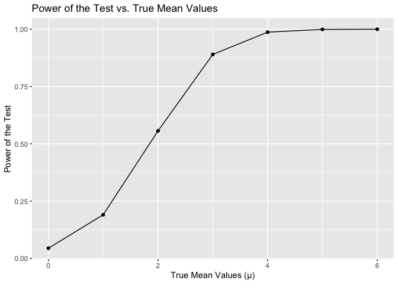
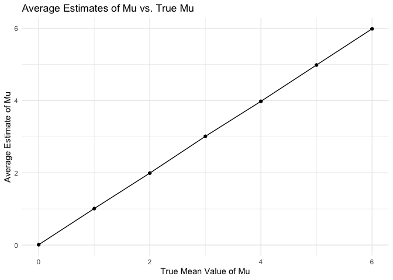
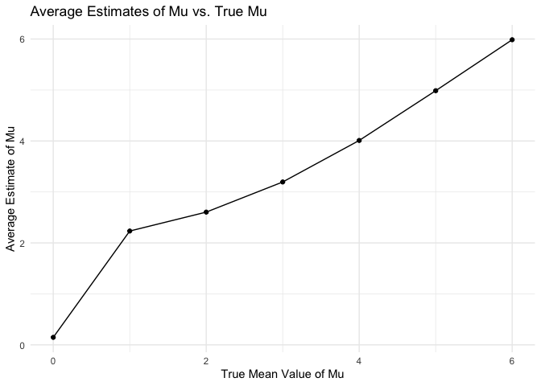
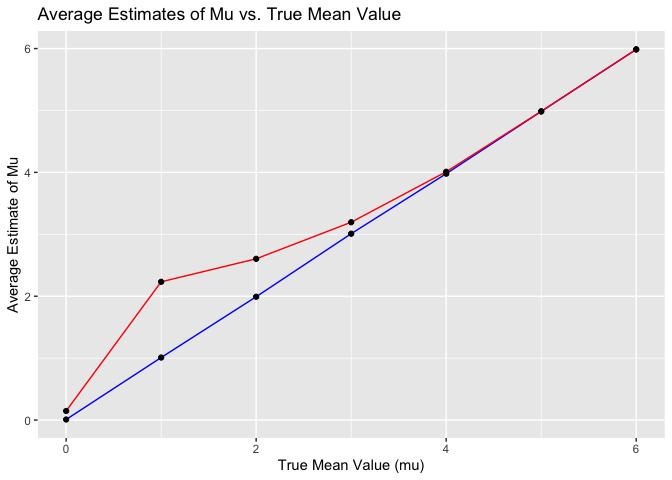

p8105_hw5_fz2377
================
Tara Zhan
2023-11-14

## Problem 1

``` r
homicide_df = read_csv("pb1/homicide-data.csv", na = c("", "NA", "Unknown")) |>
  mutate(
    city_state = str_c(city, state, sep = ", "),
    resolution = case_when(
      disposition == "Closed without arrest" ~ "unsolved",
      disposition == "Open/No arrest"        ~ "unsolved",
      disposition == "Closed by arrest"      ~ "solved")
  ) |>
  filter(city_state != "Tulsa, AL") 
city_homicide_df = homicide_df |>
  select(city_state, disposition, resolution) |>
  group_by(city_state) |>
  summarize(
    hom_total = n(),
    hom_unsolved = sum(resolution == "unsolved"))
bmore_test = 
  prop.test( 
    x = filter(city_homicide_df, city_state == "Baltimore, MD") |>
      pull(hom_unsolved),
    n = filter(city_homicide_df, city_state == "Baltimore, MD") |>
      pull(hom_total)) 
broom::tidy(bmore_test) |>
  knitr::kable(digits = 3)
```

| estimate | statistic | p.value | parameter | conf.low | conf.high | method                                               | alternative |
|---------:|----------:|--------:|----------:|---------:|----------:|:-----------------------------------------------------|:------------|
|    0.646 |   239.011 |       0 |         1 |    0.628 |     0.663 | 1-sample proportions test with continuity correction | two.sided   |

``` r
test_results = city_homicide_df |>
  mutate(
    prop_tests = map2(hom_unsolved, hom_total, \(x, y) prop.test(x = x, n = y)),
    tidy_tests = map(prop_tests, broom::tidy)) |> 
  select(-prop_tests) |>
  unnest(tidy_tests) |> 
  select(city_state, estimate, conf.low, conf.high) |>
  mutate(city_state = fct_reorder(city_state, estimate))

test_results |>
  mutate(city_state = fct_reorder(city_state, estimate)) |> 
  ggplot(aes(x = city_state, y = estimate)) + 
  geom_point() + 
  geom_errorbar(aes(ymin = conf.low, ymax = conf.high)) + 
  theme(axis.text.x = element_text(angle = 90, hjust = 1))
```

<!-- -->

## Problem 2

``` r
file_list <- list.files(path = "data", pattern = "*.csv", full.names = TRUE)
read_file <- function(file_list) {
  data <- read_csv(file_list)
  id <- str_extract(file_list, "\\d+")
  arm <- if_else(str_detect(file_list, "con"), "control", "experimental")
  data = data |>
    mutate(id = id, arm = arm)
  return(data)
}
combined_data = map_df(file_list, read_file)
pivot_data = combined_data |>
  pivot_longer(
    cols = starts_with("week"), 
    names_to = "week", 
    values_to = "values"
  ) |>
  mutate(week = parse_number(week))
plot_data = pivot_data |>
  group_by(arm, id)
ggplot(plot_data, aes(x = week, y = values, group = id, color = interaction(arm, id))) +
  geom_line() +
  geom_point() + 
  facet_grid(~arm) +
  labs(title = "Observations Over 8 Weeks by Control and Experimental Arms",
       x = "Weeks", y = "Observation Values", color = "Control/Experimental Arms") +
  theme_minimal()
```

<!-- -->

Based on the spaghetti plot, the experimental groups clearly show a
higher overall observation values than the control groups. The
experimental groups have overall increasing trend, and the control
groups have overall fluctuated trend.

## Problem 3

``` r
set.seed(123)
n = 30 # Fix n=30
sigma = 5 # Fix σ=5
mu_values = 0:6 # μ={1,2,3,4,5,6}
alpha = 0.05 # α=0.05
datasets = 5000 # Generate 5000 datasets
```

``` r
# Perform t-test, return estimate, p-value
t_test = function(mu) {
  data = rnorm(n, mean = mu, sd = sigma)
  test_result = tidy(t.test(data, mu = 0))
  return(c(test_result$estimate, test_result$p.value))}
# Initialize lists to store results
power_results = list()
estimate_results = list()
estimate_rejected_null = list()
# Simulation
for (mu in mu_values) {
  results = replicate(datasets, t_test(mu))
  estimates = results[1, ]
  p_values = results[2, ]
  #power
  power_results[[as.character(mu)]] = mean(p_values < alpha)
  # Avg_estimates
  estimate_results[[as.character(mu)]] = mean(estimates)
  # Avg_estimates when null is rejected
  estimate_rejected_null[[as.character(mu)]] = mean(estimates[p_values < alpha])}
```

``` r
# Power plot
power_df = data.frame(mu = mu_values, power = unlist(power_results))
ggplot(power_df, aes(x = mu, y = power)) +
  geom_line() +
  geom_point() +
  labs(title = "Power of the Test vs. True Mean Values",
       x = "True Mean Values (μ)", y = "Power of the Test")
```

<!-- -->

The power plot shows how the probability of rejecting a false null
hypothesis change with the true mean value (mu). As mu values increase
in effect size, the power is generally increase as well.

``` r
# Average estimate of μ̂  plot
estimate_df = data.frame(mu = mu_values, estimate = unlist(estimate_results))
ggplot(estimate_df, aes(x = mu, y = estimate)) +
  geom_line() +
  geom_point() + 
  labs(title = "Average Estimates of Mu vs. True Mu",
       x = "True Mean Value of Mu",
       y = "Average Estimate of Mu") +
  theme_minimal()
```

<!-- -->

``` r
# Average estimate of μ̂  when null is rejected plot
rejected_df = data.frame(mu = mu_values, estimate_rejected_null = unlist(estimate_rejected_null))
ggplot(rejected_df, aes(x = mu, y = estimate_rejected_null)) +
  geom_line() +
  geom_point() + 
  labs(title = "Average Estimates of Mu vs. True Mu",
       x = "True Mean Value of Mu",
       y = "Average Estimate of Mu") +
  theme_minimal()
```

<!-- -->

``` r
# Overall Average estimate of μ̂  plot
overall_df = data.frame(mu = mu_values, estimate = unlist(estimate_results), 
                          estimate_rejected_null = unlist(estimate_rejected_null))
ggplot(overall_df, aes(x = mu)) +
  geom_line(aes(y = estimate), color = "blue") +
  geom_point(aes(y = estimate)) +  
  geom_line(aes(y = estimate_rejected_null), color = "red") +
  geom_point(aes(y = estimate_rejected_null)) +
  labs(title = "Average Estimates of Mu vs. True Mean Value",
       x = "True Mean Value (mu)",
       y = "Average Estimate of Mu")
```

<!-- -->

The overall average estimate of μ̂ plot compares the average estimated mu
with the true mu. The blue line shows the average estimate across all
tests, and the red line shows the average estimate when the null
hypothesis is rejected. The average estimate of mu when null hypothesis
is rejected tends to be higher than the true mu when it is close to zero
and becomes more accurate as the true mu increases. This may caused by
Type II error, which is failing to reject a false null hypothesis. As
the true mu increases, the Type II error rate decreases, and the power
of the test increases, leading to a higher rejection rate of null
hypothesis and more accurate estimated mu value.
